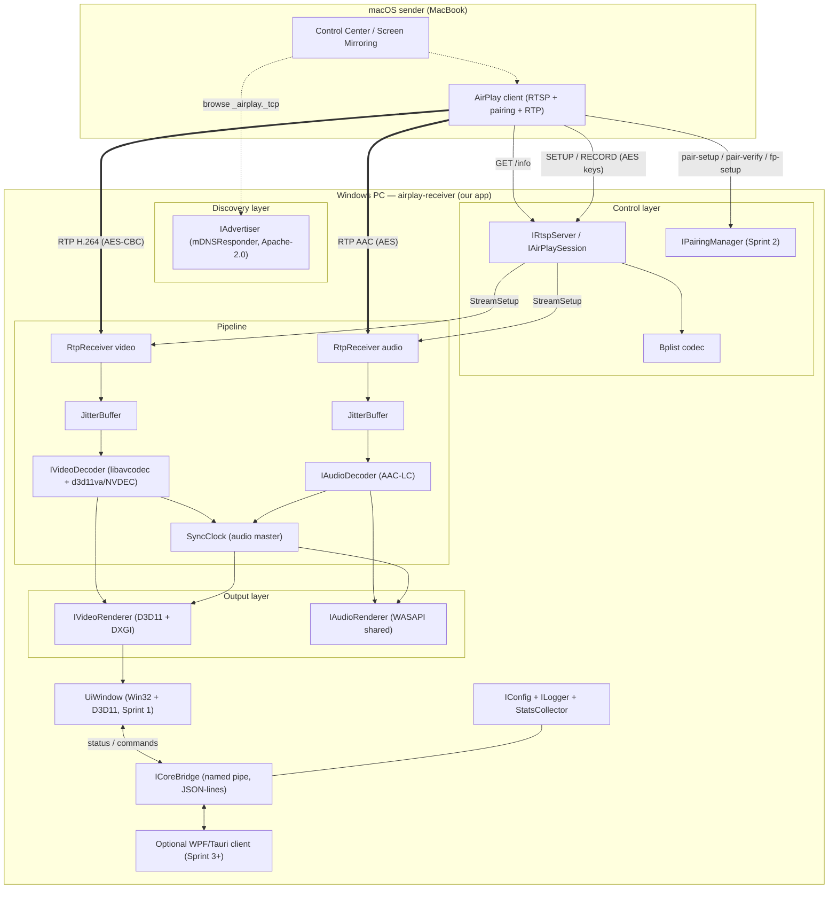

# ARCHITECTURE BRIEF — AirPlay HD Receiver (Windows)

> STEP 2 of the studio pipeline. Author: @architect. Date: 2026-09-16.
> Inputs: `docs/source/Arahan-AirPlay-App.md`, `docs/source/Dev-Environment-AirPlay.md`,
> `docs/source/Knowledge-AirPlay-App.md`, plus toolchain facts re-verified on this machine on
> 2026-09-16 (see §0). Downstream consumer: @prd-maker.
> Project licence target: **Apache-2.0** (see §1.5 — this constrains what code we may touch).

---

## 0. Machine & Toolchain Reality (verified, not assumed)

Commands run on 2026-09-16 in `C:/Users/REUMMM/airplay-receiver`:

| Probe | Result | Consequence |
|---|---|---|
| `which cmake` | **missing** (`winget` id `Kitware.CMake` is the install path) | Cannot configure/build today until installed |
| `dotnet --list-sdks` | **empty** (only a runtime stub is on PATH) | **WPF/Tauri/Electron UI is not buildable today** |
| `ffmpeg -version` | `9.0-full_build` at `...\Gyan.FFmpeg...\ffmpeg-9.0-full_build\bin` | Runtime only — **no `include/`, no `lib/`** → cannot be linked |
| dir listing of the FFmpeg root | `bin/ doc/ LICENSE presets README.txt` | confirms bin-only distribution |
| `vswhere -latest` | `C:\Program Files (x86)\Microsoft Visual Studio\18\BuildTools` | MSVC v14.x available; `cl.exe` not on PATH |
| MinGW/gcc/clang | absent | MSVC-only builds; UxPlay's MSYS2 recipe is *not* our path |
| git / Python / Node | git 2.55.0, Python 3.11.16, Node 22.23.4 present | usable for scripts/tooling |

**Rule for this project:** any dependency that is not on this box is an *install step owned by
Sprint 1*, listed in §6.4 with the exact command. A brief that assumes CMake/.NET "just exists"
is the most expensive kind of wrong.

---

## 1. Protocol Reality Check

The vault spec (`Arahan-AirPlay-App.md` §Tech Stack, `Dev-Environment-AirPlay.md` §Verifikasi) says
the PC is an **"RTSP receiver" that browses mDNS to find the MacBook**, and the mini-spec lists
`Execution: Discovery: Otomatis deteksi MacBook (mDNS)`. **That direction is inverted.** AirPlay
screen mirroring has the PC as the **receiver/server (AirPlay 2 "receiver")** and the Mac as the
**sender**: the PC publishes itself over Bonjour/DNS-SD, the Mac discovers it, and the Mac opens an
RTSP-like control connection to the PC.

### 1.1 Corrected data flow

```
macOS (sender)                                   PC (receiver — our app)
  │ 1. browse PTR _airplay._tcp.local / _raop._tcp.local
  │ 2. resolve SRV + TXT + A/AAAA       ◄─── mDNS multicast 224.0.0.251:5353 (and ff02::fb)
  │ 3. TCP connect → SRV port (7000 typical; MUST be read from SRV, never hardcoded)
  ├──────────── RTSP-like control (TCP) ─────────►  RTSP server (our process)
  ├──────────── pairing + FairPlay (TCP) ────────►  pairing/FairPlay module
  ├──────────── RTP/UDP video (H.264, encrypted) ►  video path (decrypt → decode → D3D11)
  ├──────────── RTP/UDP audio (AAC, encrypted) ──►  audio path (decrypt → AAC → WASAPI)
  └──────────── RTCP / timing (UDP) ─────────────►  clock + sync
```

**Browsing is NOT required for v1.** The PC must *advertise*. Browsing (`_airplay._tcp` browse) is
only useful for a later diagnostics panel ("see other AirPlay receivers on the LAN"), and adding it
in Sprint 1 only creates a second source of truth for "is the service up".

### 1.2 Services + TXT records the PC must register

Sources: [Unofficial AirPlay Specification — Service Discovery](https://openairplay.github.io/airplay-spec/service_discovery.html),
[airplay2-rs AIRPLAY_2_SPEC.md (complete TXT key table)](https://github.com/lmcgartland/airplay2-rs/blob/master/AIRPLAY_2_SPEC.md),
[pyatv — Protocols](https://pyatv.dev/documentation/protocols/).

`_airplay._tcp.local` — control endpoint (this is the one Control Center shows as a mirror target):

| TXT key | Value we plan (Sprint 1) | Notes |
|---|---|---|
| `deviceid` | our MAC as `aa:bb:cc:dd:ee:ff` | spec: "usually MAC address" |
| `features` | 64-bit mask as `0xLOWER,0xUPPER` | **Transient profile — locked (D5, §9.1):** bits **7** `SupportsAirPlayScreen`, **9** `SupportsAirPlayAudio`, **30** `RAOP`, **42** `SupportsScreenMultiCodec`, **48** `SupportsTransientPairing` → `features=0x40000280,0x10400` (recomputed here with a script, not copied: lower word `0x40000280`, upper word `0x10400`). Bit **27** `SupportsLegacyPairing` is **deliberately not advertised** — the legacy/PIN profile was dropped. Gate 1.11 = the advertised mask must equal what Sprint 2 actually implements |
| `flags` | `0x4` (status flags bitfield) | receiver state bitfield |
| `model` | `AppleTV3,2` class string | must be consistent with `sourceVersion` we claim |
| `srcvers` | a plausible version (e.g. `220.68`) | legacy path; UxPlay/RPiPlay use the legacy AirTunes version string |
| `pk` | 32-byte Ed25519 public key (hex) | **Sprint 1** — generate and persist a permanent receiver identity at first run (OpenSSL is already in the stack) and advertise the *final* value from day one, so the discovery gate (1.3) never has to be re-tested. ⚠️ reviewer advisory: macOS keys part of its acceptance/"remember this receiver" behaviour on `deviceid` + `pk` |
| `pi` / `psi` | pairing UUIDs (group / system pairing identity) | **Sprint 1** — generated into the same identity file; consumed by pairing in Sprint 2 |
| `vv` / `protovers` | protocol version | keep minimal in Sprint 1 |
| `rsf` | required-sender-features hex | optional; omit in Sprint 1 |

`_raop._tcp.local` — legacy AirTunes/AirPlay-audio endpoint. **Service instance name must be
`<MAC-uppercase>@<Display Name>`** (e.g. `AABBCCDDEEFF@Arakatian PC`):

| TXT key | Value | Meaning |
|---|---|---|
| `txtvers` | `1` | TXT record version |
| `ch` | `2` | stereo |
| `cn` | `0,1,2,3` | PCM, ALAC, AAC, AAC-ELD |
| `et` | `0,3,5` | no-encryption, FairPlay, FairPlay SAPv2.5 |
| `md` | `0,1,2` | text, artwork, progress |
| `pw` | `false` | no password |
| `sr` / `ss` | `44100` / `16` | sample rate / size |
| `tp` | `UDP` | transport |
| `vn` | `65537` | AirTunes protocol version |
| `vs` / `am` | version / model string | parallels `srcvers` / `model` |
| `sf` / `ft` | flags / features hex | mirrors `flags` / `features` |

Not needed for v1: `_airplay-p2p._tcp` (AWDL peer-to-peer; Apple devices prefer it, but infrastructure
Wi-Fi works — see [Apple: Use AirPlay with Apple devices](https://support.apple.com/guide/deployment/use-airplay-dep9151c4ace/web),
which lists Bonjour, Bluetooth-IP advertisement and peer-to-peer discovery as alternatives),
`_leboremote._tcp`, `_companion-link._tcp`, HomeKit `_hap._tcp`.

### 1.3 Handshake we actually have to implement

Grounded in a real packet capture of an AirPlay 2 mirror session
([UxPlay wiki — AirPlay2 analysis](https://github.com/FDH2/UxPlay/wiki/AirPlay2)) and
[pyatv RAOP/AirPlay command docs](https://pyatv.dev/documentation/protocols/):

```
GET /info            RTSP/1.0  (body: bplist {qualifier:[txtAirPlay]})
   ← 200 OK, bplist: name, deviceID, macAddress, model, sourceVersion, features,
                     statusFlags, vv, audioFormats, displays{width,height,refreshRate},
                     keepAliveLowPower, …                       ← Sprint 1 target ends here
POST /pair-setup     (TLV8; SRP-6a for HomeKit-style, or legacy FairPlay)   M1…M6   ← Sprint 2
POST /pair-verify    (Curve25519 + Ed25519, X-Apple-PD:1)                  M1…M4   ← Sprint 2
POST /fp-setup       (FairPlay, X-Apple-ET: 32, FPLY blobs)                2 round trips
SETUP                body: bplist {streams:[{type:110 …}, {type:96 …}]}    ← ports + AES key/IV returned
RECORD               → sender starts sending RTP
GET_PARAMETER / SET_PARAMETER / feedback   heartbeat + volume + progress
TEARDOWN             streams type 96 (audio) / 110 (video) on disconnect
```

Field names used by the sender in `/info` responses and the volume/heartbeat/TEARDOWN flows are
verbatim from that capture; the `type` codes matter: **110 = mirroring video, 96 = realtime audio**.

RTP sockets and ports are **negotiated inside SETUP** rather than assumed. Sprint 1/2 action item:
capture one real session (`Wireshark`, filter `tcp.port==7000 || udp.port==6000`) and record which
side allocates `dataPort` / `controlPort` / `timingPort` before wiring sockets — do **not** hardcode
port 6000. Firewall planning must cover the SRV port, `5353/udp`, and a 6000–6010/udp window.

### 1.4 Pairing / encryption — what is required, what can wait

- Every open-source receiver in existence (RPiPlay, UxPlay, AirPlayServer, airplay2-receiver) drives
  the **legacy mirroring path**: FairPlay `fp-setup` handshake + AES-128-CBC per-stream keys
  (`X-Apple-ET: 32`), delivered in the SETUP response.
- History shows why we cannot skip it: since **tvOS 10.2** Apple made sender device verification
  mandatory, and iOS 11.4 added AirPlay 2 whose control channel is **encrypted after pair-verify**
  (documented in [RPiPlay's AirPlay protocol history](https://github.com/FD-/RPiPlay#airplay-protocol-versions)).
- **Sprint 1 realistically achieves:** PC advertises both services; the Mac sees the PC in Control
  Center / Screen Mirroring list; the Mac can open TCP and we answer `GET /info` with a valid bplist;
  the session then fails cleanly at pairing (`501`/documented error) **without crashing**. That is a
  legitimate, verifiable Sprint 1 gate — *not* a picture.
- **A picture requires Sprint 2**: implement `pair-setup`/`pair-verify`/`fp-setup`, derive the
  session keys, decrypt the streams, then decode/present. Until that exists, any claim of "we receive
  AirPlay video" is false.
- **Pairing mode is decided (2026-09-16): TRANSIENT** (`X-Apple-HKP: 4`) — it completes at M4, so it skips
  M5/M6 Ed25519 *and* pair-verify, needs no pairing store and no PIN screen: the shortest honest path to a
  picture in Sprint 2. PIN/legacy pairing stays *specced but unbuilt* (DESIGN.md §8.2) and would be a
  Sprint 3+ feature. **Why it had to be decided before Sprint 1 code:** the choice is baked into the
  advertised TXT record — *transient* (no PIN, session-only, `features` bit 48 `SupportsTransientPairing`,
  implied by bit 43) vs *PIN* (HomeKit-style pair-setup with a code the receiver displays, which needs a PIN
  surface *and* a pairing store). Advertising one mode while implementing the other produces a receiver that
  is visible but never connects, so the advertised `features`/`flags` must match reality — enforced by gate 1.11.
- **User decision (2026-09-16): the first mirrored frame is a Sprint 2 gate, not a Sprint 1 gate.**
  Sprint 1 = discovery + `/info` + native window + clean shutdown (§8 gates 1.1–1.12); the vault's
  Sprint-1 acceptance wording ("Mac lihat PC di list, bisa connect, ada frame") is **deliberately
  superseded**, so a missing frame must not be reported as a Sprint 1 bug.
- AirPlay 2 features that are **out of scope for v1**: multi-room/grouped audio, PTP-based timing
  (feature bit 41), buffered audio (bit 40), HomeKit pairing (bits 46/43/48), MFi (needs Apple
  hardware, impossible for us).

### 1.5 Licence constraints (this decides what code the team may read-and-copy)

| Project | Licence | May we link/copy? |
|---|---|---|
| [UxPlay](https://github.com/FDH2/UxPlay) | **GPL-3.0** (bundles PlayFair GPL, shairplay LGPL-2.1+) | ❌ read for protocol understanding only; **no code, no linking** |
| [RPiPlay](https://github.com/FD-/RPiPlay) | **GPL-3.0** | ❌ same |
| [openairplay/airplay2-receiver](https://github.com/openairplay/airplay2-receiver) | ⚠️ check per-file (FairPlay decrypt code published as reverse-engineering note) | ⚠️ treat as documentation, not as a library |
| [shairport-sync](https://github.com/mikebrady/shairport-sync) | **mixed**: Fedora packaging lists `MIT AND BSD AND GPL-3.0` ([source](https://packages.fedoraproject.org/pkgs/shairport-sync/shairport-sync/)), Arch lists `GPL-2.0-only` ([source](https://archlinux.org/packages/extra/x86_64/shairport-sync/)) | ⚠️ **not "MIT, safe to link"** as the vault note claims — reference only; verify per-file before ever vendoring |
| [mikebrady/alac](https://github.com/mikebrady/alac) | **Apache-2.0** (LICENSE verified) | ✅ linkable (only needed if we later do ALAC audio) |
| [apple-oss-distributions/mDNSResponder](https://github.com/apple-oss-distributions/mDNSResponder/blob/main/LICENSE) | **Apache-2.0** (majority) | ✅ linkable; also packaged as [`mdnsresponder` in vcpkg](https://vcpkg.io/en/package/mdnsresponder.html) |
| [postlund/pyatv](https://github.com/postlund/pyatv) | MIT (Python, protocol docs) | ✅ documentation/reference |
| [FFmpeg](https://ffmpeg.org/legal.html) | LGPL-2.1+ by default; GPL if built `--enable-gpl` | ✅ link LGPL build; **avoid `--enable-nonfree`/`fdk-aac`** |
| OpenSSL 3.x | Apache-2.0 | ✅ |
| Live555 | LGPL-2.1+ (static linking has relink obligations) | ⚠️ avoid for now (see §3) |

**Hard rule:** our repo ships Apache-2.0. GPL-3.0 code (UxPlay/RPiPlay) may be *read* to understand
the wire format, and every such derivation must be re-implemented from observed protocol behaviour,
with the source URL recorded in `docs/architecture/protocol-notes.md`. No GPL/AGPL file may be copied
into `src/` or vendored into `third_party/`. CI gets a licence check (§6.3).

---

## 2. Component Map

| # | Component | Layer | Responsibility |
|---|---|---|---|
| C1 | `Advertiser` (mDNS/DNS-SD publisher) | Discovery | Register `_airplay._tcp` + `_raop._tcp` with TXT/SRV/A through the **Bonjour daemon API** (`dnssd.dll`, dynamically loaded) — **never binds UDP 5353 itself while the daemon is present** (§3). Re-advertise when config (name, port, features) changes; clean deregistration on shutdown; if `dnssd.dll` is missing → clear, actionable error, not a silent failure |
| C2 | `RtspServer` | Control | TCP listener on the SRV port; RTSP/1.0 request parser (request line + headers + body, `Content-Type: application/x-apple-binary-plist`); routes `/info`, `/pair-setup`, `/pair-verify`, `/fp-setup`, `SETUP`, `RECORD`, `SET_PARAMETER`, `GET_PARAMETER`, `FLUSH`, `TEARDOWN`, `/feedback`; CSeq handling; per-session state machine |
| C3 | `Bplist` codec | Control | minimal binary-plist reader/writer (dict/array/string/int/bool/real/data/date/UID) — ~500 LOC, no external dep |
| C4 | `PairingManager` | Security (Sprint 2) | SRP-6a + HK TLV8 pairing (transient and/or PIN mode — mode is a **Sprint 1** decision, §1.4/§9.2), Curve25519/Ed25519 verify, FairPlay `fp-setup`, HKDF key derivation, persistent pairing store (`%LOCALAPPDATA%\Arakatian\AirPlayReceiver\pairings\`) |
| C5 | `StreamCrypto` | Security (Sprint 2) | per-stream AES-128-CBC (video) / AES key unwrap for audio, HMAC-SHA1 integrity where used; holds keys returned by SETUP |
| C6 | `RtpReceiver` | Transport | one UDP socket per stream (+ TCP-interleaved fallback); RTP parse, seq/timestamp tracking, reorder buffer, loss detection, RTCP retransmit requests |
| C7 | `JitterBuffer` | Pipeline | adaptive 30–80 ms window, drops late packets, exposes stats (lost/late/reordered) |
| C8 | `VideoDecoder` | Media | FFmpeg `libavcodec` H.264 (H.265 later); hardware device via `d3d11va` (default) or `cuda`/NVDEC when present; software fallback; outputs NV12 with PTS |
| C9 | `VideoRenderer` | Media/Output | D3D11 device + flip-model DXGI swap chain; NV12 shader path; borderless fullscreen/window; frame pacing to the sync clock; presents at vsync |
| C10 | `AudioDecoder` | Media | FFmpeg AAC-LC decoder (mirror mode audio is AAC — [UxPlay README](https://github.com/FDH2/UxPlay) states mirror mode streams lossily-compressed AAC) + `swresample` to the device mix format |
| C11 | `AudioRenderer` | Media/Output | WASAPI (shared mode default, event-driven); PCM ring buffer; **clock master** for A/V sync; exclusive-mode opt-in for low latency |
| C12 | `SyncClock` | Pipeline | correlates RTP/NTP timestamps with the host QPC clock; publishes `audio_clock` and `av_delta_ms`; drives renderer pacing |
| C13 | `ConfigStore` | Data | `%APPDATA%\Arakatian\AirPlayReceiver\config.json` (device name, **`locale`**, UI scale, audio device, buffer ms, hw decode on/off, log level); hot-reload |
| C14 | `Logger` | Common | leveled, rotating file log (`%LOCALAPPDATA%\Arakatian\AirPlayReceiver\logs\`) + optional console; ring of last N lines for the UI "diagnostics" pane |
| C15 | `CoreBridge` | IPC | named-pipe server, JSON-lines protocol (§5.8): status/FPS/latency/stream stats out; commands in (set volume, toggle fullscreen, reload config, switch audio device) |
| C16 | `UiWindow` | UI | Sprint 1: Win32 + D3D11 window owned by the core (title, FPS/status overlay, ESC/Alt+F4 handling) — **every visible string resolves through `i18n::get("key")`, never a literal** (D6). Pairing is **transient (D5)**, so **no PIN surface is built**: the PIN screen stays specced-but-unbuilt in `docs/design/DESIGN.md` §8.2 and would only return as a Sprint 3+ feature if persistent trusted devices are ever wanted. Sprint 3+: WPF client over `CoreBridge` with settings/status/tray/hotkeys |
| C17 | `TrayAndHotkeys` | UI (Sprint 3) | `Shell_NotifyIcon`, `RegisterHotKey` (toggle fullscreen, mute, show stats, quit) |
| C18 | `StatsCollector` | Common | 1 Hz: FPS, dropped frames, late packets, av_delta_ms, CPU%, RAM MB → log + `CoreBridge` |
| C19 | `Installer` | Distribution (Sprint 4) | Inno Setup EXE (and/or WiX MSI): app files, VC++ runtime, firewall rules, **Bonjour runtime-dependency check** (detect the service; prompt/instruct or bundle — Apple's redistribution terms must be checked before bundling), Start-menu entry, uninstall |

Layers: **UI** (C16, C17) · **IPC** (C15) · **Core services** (C1–C6, C12–C14, C18) · **Media** (C8–C11) · **Windows platform** (WASAPI, D3D11, DXGI, Win32, Winsock) · **Data** (C13, config/logs/pairings, no database — there is no user data in v1).

---

## 3. Stack per Layer

| Layer | Choice (firm) | Why | Rejected alternatives |
|---|---|---|---|
| **Language (core)** | **C++20** on MSVC — **local:** VS 18 BuildTools (`cl.exe` 14.51.36231 + Windows SDK 10.0.26100, verified by @deployer and @reviewer); **CI:** VS 2022 `17.14` on `windows-latest` | Needed for direct D3D11/WASAPI/Winsock; C++20 gives `std::span`, `jthread`, `std::atomic_ref` and RAII for socket/COM lifetimes. Compiler is already on the box. | C (no RAII, slower to make safe) · Rust (no toolchain; would need a full rewrite and FFI for D3D11/WASAPI) · C# core (GC framing/latency risk, and no .NET SDK installed) |
| **Build system** | **CMake ≥ 3.25**, generator **`Visual Studio 18 2026` on both CI and local** (runner vswhere-verified as VS 18 Enterprise, local as VS 18 BuildTools — same MSVC 14.51 toolset, so `CLAUDE`-style "works locally, dies in CI" drift disappears). Confirm the string with `cmake --help` once per machine, then keep it in `CMakePresets.json` (`local-vs18`, `ci`). | Spec'd, CI-native, handles MSVC + vcpkg toolchain in one line. **Not installed yet** → `winget install --id Kitware.CMake -e` is a Sprint 1 task. Never type a generator string from memory: it is version-specific and a wrong one fails configure, not compile. | Hand-written `.vcxproj` (unreviewable, CI-hostile) · Meson (smaller Windows ecosystem) · Bazel (overkill) |
| **Dependency manager** | **vcpkg manifest mode** (`vcpkg.json`; **builtin registry** — no `vcpkg-configuration.json` for now, deviation signed off 2026-09-16) | Reproducible dependency selection for FFmpeg/mDNSResponder/OpenSSL/spdlog; preinstalled on GitHub runners (`VCPKG_INSTALLATION_ROOT=C:\vcpkg`) and installable locally via `git clone` + `bootstrap-vcpkg.bat` (no admin; keep the clone at `C:/dev/vcpkg`, **outside** the repo, so `.gitignore` needs no special-casing). | Git submodules of every dep (hours of CI build time for FFmpeg) · hand-downloaded binaries (the reason this brief exists) |
| **FFmpeg delivery** | **vcpkg `ffmpeg`** with features `[avcodec, avformat, swscale, swresample, nvcodec]`, declared as the **optional manifest feature `video`** and gated in CMake by `AIRPLAY_ENABLE_FFMPEG` (default OFF) — Sprint 1 does **not** link libavcodec, so its build must not depend on this package (see §6.4) (add `gpl` **only** if we ever need x264/x265, and never `nonfree`/`fdk-aac`) | Ships `include/` + `.lib` (linkable) and can be pinned; `nvcodec` adds NVDEC/NVENC; D3D11VA is part of the Windows build. Feature names verified on the [vcpkg ffmpeg page](https://vcpkg.io/en/package/ffmpeg.html). | The **installed gyan.dev "full" build — verified bin-only, no headers/libs → impossible to link** · [BtbN `ffmpeg-master-latest-win64-lgpl-shared`](https://github.com/BtbN/FFmpeg-Builds/releases) as an *offline fallback* only (unpinned, prebuilt, but it does ship `include/`+`lib/`) — **the `lgpl-` variant**, never `gpl-`, so our Apache-2.0 redistribution story survives |
| **mDNS / DNS-SD** | **Register through the already-running Bonjour daemon**: call `DNSServiceRegister` in `dnssd.dll` (loaded dynamically) from an `IAdvertiser` implementation; vendor the Apache-2.0 `dns_sd.h` header from [apple-oss-distributions/mDNSResponder](https://github.com/apple-oss-distributions/mDNSResponder) into `third_party/mDNSResponder/include/`. vcpkg port `mdnsresponder` becomes the **optional feature `mdns`** (`-DVCPKG_MANIFEST_FEATURES=mdns`) for machines with no Bonjour. | Verified on this machine (2026-09-16): **Bonjour Service is RUNNING** (`mDNSResponder.exe` pid 10956) and already holds `192.168.1.14:5353`, while three *other* PIDs hold `0.0.0.0:5353`. So UDP 5353 is **already owned** — a second responder would either fail to advertise or become the flaky receiver everybody complains about. Going through the daemon is both the shortest path and the correct one, gives us the same conflict resolution Apple devices expect, and needs **zero new build deps** (`C:\Windows\System32\dnssd.dll` present, 85,864 B). | **Hand-rolled responder binding 5353 while a daemon is present** — rejected, that is a port/conflict fight (R4); it stays the fallback only for machines *without* Bonjour, and then it must own 5353 exclusively · **Bonjour SDK for Windows v3.0** — verified **absent** (`no dns_sd.h` anywhere on disk) and it is a developer-only Apple download; and the SDK CLI `dns-sd` build is broken here anyway (`afxres.h`; **no `atlmfc`** in VS 18 BuildTools) · **vcpkg `mdnsresponder` as a hard dependency** — pointless while a daemon is running, **and** its bundled `dns-sd` CLI target cannot build here (measured by @deployer: `RC1015: cannot open include file 'afxres.h'`, VS 18 BuildTools has no MFC). The port's `dnssd.dll`/`dnssd.lib` *do* build, so it stays the fallback — as the optional feature `mdns`, enabled with `-DVCPKG_MANIFEST_FEATURES=mdns` · Avahi (Linux-only) · browsing via a Python/Node helper (absurd for a shipped app) |
| **Control-protocol parser** | **Own minimal RTSP/1.0 parser** in `src/core/rtsp/` + our `Bplist` codec (C3) | We speak a *small* subset; owning it keeps the state machine debuggable and licence-clean, and makes the packet-capture work directly usable as test fixtures. | **Live555** — built around RTP *client*/server frameworks and AirPlay semantics aren't its model; LGPL static-link obligations; large surface for zero gain here · full HTTP servers (cpp-httplib/Boost.Beast) don't speak RTSP framing |
| **Crypto / pairing primitives** | **OpenSSL 3.x** (Apache-2.0) from vcpkg | AES-128-CBC, HMAC-SHA1, X25519/Curve25519, Ed25519, SHA-512, HKDF all in one Apache-licensed lib. | mbedTLS (Apache-2.0, fine but fewer primitives for SRP) · libsodium (ISC; no AES-CBC) · OpenSSL **1.1** (older licence, EOL) |
| **Video decode** | **FFmpeg `libavcodec`** with:
 1. `d3d11va` hardware path (Intel/AMD/any D3D11 GPU),
 2. `cuda`/NVDEC when an NVIDIA GPU is present,
 3. software decode fallback (always compiled in) | One decoder API across hardware vendors; the *installed* FFmpeg already advertises `--enable-nvdec --enable-cuvid --enable-d3d11va --enable-dxva2`, so the runtime path is proven — we just need a linkable build. | Media Foundation (less control over latency/format negotiation; awkward for H.264-in-RTP) · NVDEC-only (RTX 3060 present here, but shipping NVIDIA-only breaks the install base) · GPU-agnostic VA-API (not Windows) |
| **Video render** | **Direct3D 11 + DXGI flip-model swap chain** on an NV12 texture, own shader | Lowest-latency present path on Windows, explicit vsync control (`Present(1,0)`), and it needs **zero extra SDK** (D3D11 ships with Windows). | Media Foundation EVR (extra indirection, less control) · WPF `Image`/`D3DImage` (per-frame copy, GC pressure, and no .NET SDK installed) · GDI (`StretchBlt`) — 1080p60 yuv→rgb on the CPU blows the CPU budget · OpenGL/Vulkan (nothing here needs them) |
| **Audio output** | **WASAPI, shared mode, event-driven**, 48 kHz float, ~20 ms device period. Exclusive mode as an opt-in toggle in Settings. | Shared mode is the only option that doesn't take the device away from the user; event-driven rendering + a small ring buffer hits <50 ms without exclusive-mode stability costs. | DirectSound (deprecated) · ASIO (driver requirement) · XAudio2 (MixFormat control is clumsier for a ring-buffer design) |
| **Audio decode** | FFmpeg native **AAC-LC** decoder + `swresample` | Mirror-mode audio is AAC; FFmpeg decodes it under LGPL. Avoids the `fdk-aac` **non-free** licence trap. | fdk-aac (non-free — would poison our binary redistribution) · ALAC via mikebrady/alac (Apache-2.0, but not needed for mirroring) |
| **Config format** | JSON (`nlohmann::json` or a 200-LOC reader) in `%APPDATA%` | Human-editable, no schema tooling needed, easy to log/diff. | TOML (extra dep for no gain) · Windows registry (opaque, hard to support) · YAML (dep + footguns) |
| **Logging** | **spdlog** (MIT) via vcpkg, rotating sink | Small, fast, header-friendly, level filtering; saves us writing a logger. | Own logger (doable but pointless) · Windows ETW (noise for a v1) |
| **Test framework** | **Catch2 v3** (BSL-1.0) + `ctest` | Single-header-ish, no codegen, ideal for the protocol-fixture tables (bplist, RTP, TXT) we will write. | GoogleTest (fine, heavier) · hand-rolled asserts (bad for CI signal) |
| **IPC core↔UI** | **Named pipe** `\\.\pipe\arak-airplay-core-<pid>`, **JSON-lines** framing, versioned `v` field; plus an optional shared-memory ring for UI frame preview | Zero dependencies (Win32 `CreateNamedPipe`), trivially debuggable from any language, works with Win32 *now* and with a WPF/Tauri client later without changing the core. | Local WebSocket (needs an HTTP/WS server + deps in the core) · nng (extra dep for a single local client) · embedding UI in-process (a UI crash must not kill the stream) · COM out-of-proc (boilerplate) |
| **UI** | **Sprint 1: Win32 + D3D11 window inside the core** (builds on this machine today, 0 extra installs, installer stays small). **Sprint 3: optional WPF (.NET 8) client over `CoreBridge`** — only if the team accepts a .NET SDK install step. | The Sprint 1 deliverable ("window with a frame, Settings stubs") is achievable *now*; the UI framework choice must not gate the engine. | **WPF/Tauri/Electron in Sprint 1: not buildable today** (no .NET SDK, no Rust/cargo — verified) — choosing them now converts a 2-week sprint into toolchain setup · Electron also blows the <100 MB installer budget (per the vault spec itself, ~150 MB) |
| **Installer** | **Inno Setup 6.x** for v1.0.0 (MSI/WiX as a later option) | Single EXE, scripting is quick, supports firewall rules, VC++ runtime bundling, ~small overhead. WiX v4/v5 remains the fallback if MSI is a hard requirement. | WiX-only from day 1 (slower first release) · MSIX (signing/Store friction for an open-source side project) |
| **CI** | **GitHub Actions `windows-latest`**: manifest-mode vcpkg (binary-cached) → configure/build → `ctest` → artifact; separate release job builds the Inno Setup installer | Runner ships **CMake 3.31.6**, **vcpkg at `C:\vcpkg`**, Ninja 1.13.2 — and, **measured by the workflow's own `vswhere` step (runs 35007094126/35009325571/35011478579/35011872714): Visual Studio 18 Enterprise `18.0`, MSVC `14.51.36231`**, i.e. the **same toolset as this dev box**, *not* the VS 17 2022 the image readme implies. | Self-hosted runner (not available) · Azure Pipelines (no benefit here) |

---

## 4. Threading & Queues

### 4.1 Thread inventory

| Thread | Blocks on | Owns | Exit condition |
|---|---|---|---|
| T1 `mdns` | mDNSResponder's own socket loop (it manages its own thread/socket) | service registration + TXT/SRV updates | deregister + stop |
| T2 `rtsp-accept` | `accept()` on the SRV port (with a shutdown `WSAEventSelect`/wakeup socket) | listening socket, session table | stop signal → close listener |
| T3…`rtsp-session-N` (one per connection) | `recv()` per session | that session's request parsing/state machine, SETUP/RECORD/keepalive | TEARDOWN, socket error, or shutdown |
| T4 `rtp-video` | `recvfrom()` on the video UDP socket | RTP parse + seq ordering → `q_video_pkt` | shutdown → close socket |
| T5 `rtp-audio` | `recvfrom()` on the audio UDP socket | RTP parse → `q_audio_pkt` (audio gets priority, smaller buffers) | shutdown |
| T6 `video-decode` | `q_video_pkt` (bounded condvar queue) | FFmpeg decoder context + `q_video_frame` | drain then exit |
| T7 `render` | swap-chain Present / frame-ready event | D3D11 device + swap chain + NV12 texture pool; **the only thread that calls Present** | stop signal → drain 1 frame → release |
| T8 `audio-render` | WASAPI event handle | audio device client + PCM ring; **the clock master** | stop → final `IAudioClient::Stop` |
| T9 `ui` | Win32 `GetMessage` | window, input, overlay drawing (Sprint 1: the render window's message pump is separate from T7; drawing happens in T7) | WM_QUIT |
| T10 `stats` | 1 s timer | counters → log + `CoreBridge` push | stop |
| T11 `bridge` | named-pipe connect/read | JSON-lines in/out to a UI client (optional in Sprint 1) | pipe closed / shutdown |

Priority discipline: **`rtp-audio` + `audio-render` > `rtp-video`/`video-decode` > `render` > everything else.**
Raise audio/render threads to `THREAD_PRIORITY_ABOVE_NORMAL`, keep decode/network at normal, and pin the
whole process to no more than the CPU budget in §8 by *dropping work*, not by sleeping.

### 4.2 Queues and buffers

| Queue | Shape | Capacity | Overflow policy |
|---|---|---|---|
| `q_video_pkt` | SPSC ring, fixed-slot (packet metadata + ≤2 KB payload) | 512 slots | **drop newest is wrong here** — drop the *oldest* complete frame, count `video_drop_frames`, never split a frame's packets |
| `q_audio_pkt` | SPSC ring | 256 slots | drop oldest + reconnect-style resync if the gap exceeds 100 ms; log `audio_gap_ms` |
| Jitter (video) | reorder window over seq numbers | 30–80 ms adaptive (start 40 ms) | late → drop + request retransmit if the timestamp budget allows |
| Jitter (audio) | reorder + conceal window | 30 ms target | drop late, count |
| `q_video_frame` | decoded-frame pool | **3 buffers** (1 rendering, 2 in flight) | block the decoder briefly, then drop oldest *undisplayed* frame |
| PCM ring (audio) | SPSC byte ring in device mix format | 40 ms | if the ring ever underruns, grow the target latency (adaptive) rather than glitching |
| Config/log | single-writer, no queueing | — | filesystem writes are async via spdlog's thread |

**Drop policy in one line:** never block the network threads; drop whole frames/packets at the
oldest end; every drop increments a counter that surfaces in `stats` and the UI. A silent drop is a
bug.

### 4.3 Clock / sync master

**Audio is the master clock.** Rationale: an audible audio glitch is worse than a dropped video
frame, and the WASAPI device clock is the only clock the output hardware actually obeys.

```
sender RTP ts ──► SyncClock (correlate to host QPC using the NTP/timing exchange + arrival estimate)
                                   │
        ┌──────────────────────────┴───────────────────────┐
        │                                                  │
  audio path: pull PCM to keep ring≈target           video path: present frame when
  (WASAPI drives the true rate)                      frame.pts <= audio_clock + lead
                                                     (Present(1,0) at vsync)
        └──────────► av_delta_ms = video_pts − audio_clock ─────► stats + UI
```

- Video-only sessions (no audio stream) fall back to a monotonic QPC clock with vsync pacing.
- `av_delta_ms` is measured, logged, and shown; the **<50 ms** Sprint 3 gate is judged on its
  5-minute p95, not on a screenshot.
- Any drift correction adjusts *which frame* we present while the audio device keeps its rate
  (sample-rate nudging by ±0.05 % is the last resort, behind a config flag).

### 4.4 Shutdown ordering (must be explicit, or we get crashes on exit)

1. `stats`/`bridge` stop pushing.
2. `rtsp-accept` stops accepting; existing sessions get TEARDOWN and are closed.
3. RTP threads stop; sockets closed; jitter buffers released.
4. `video-decode` drains and its context is freed (`avcodec_free_context`).
5. `audio-render` stops the device client, then releases it.
6. `render` stops and releases the swap chain/D3D11 device **last** (nothing may present after this).
7. `ui` window destroyed, `mdns` deregisters services, logs flushed.
8. A 3-second watchdog: if any stage hangs, log the stage and `ExitProcess(2)` (a hung tray app the
   user can't kill is worse than an unclean exit).

---

## 5. Interfaces

Headers live in `src/core/<module>/include/`. All interfaces are pure-virtual, no exceptions across
boundaries, `noexcept` destructors, and every method returns a status enum (`CoreStatus`).

### 5.1 Common (`src/common/`)

```cpp
enum class CoreStatus { Ok = 0, Again, Timeout, Unsupported, ProtocolError, CryptoError,
                        IoError, NotInitialized, ShuttingDown };
struct FrameRef { uint8_t* data; size_t size; int64_t pts_ns; };   // never owned
```

### 5.2 `IAdvertiser` (mDNS/DNS-SD)

```cpp
struct ReceiverIdentity {                 // the single source of truth for TXT/SRV values
  std::string deviceId;                   // "aa:bb:cc:dd:ee:ff"
  std::string name;                       // "Arakatian PC"
  std::string model;                      // "AppleTV3,2"
  std::string sourceVersion;              // "220.68"
  uint64_t    features;                   // 64-bit mask -> encoded "0xLOWER,0xUPPER"
  uint64_t    flags;                      // status flags
  std::string publicKeyHex;               // optional (Sprint 2)
  std::string pairingId, systemPairingId;  // optional (Sprint 2)
  uint16_t    rtspPort;                   // actual bound port (SRV target)
};

class IAdvertiser {
public:
  virtual ~IAdvertiser() = default;
  virtual CoreStatus start(const ReceiverIdentity&, std::string_view ifaceHint) = 0;
  virtual CoreStatus update(const ReceiverIdentity&) = 0;   // re-register TXT on config change
  virtual CoreStatus stop() noexcept = 0;
  virtual std::vector<std::string> localAddresses() const = 0;   // for the UI + logs
};
```

### 5.3 `IRtspServer` / `IAirPlaySession`

```cpp
struct SessionLimits { int maxSessions = 1; int keepAliveTimeoutMs = 15000; };

class IAirPlaySession {                    // one control connection
public:
  virtual ~IAirPlaySession() = default;
  virtual std::string peerAddress() const = 0;
  virtual SessionState state() const = 0;  // Connecting|InfoDone|Paired|Streaming|Tearing|Closed
  virtual CoreStatus teardown() noexcept = 0;
};

class IRtspServer {
public:
  virtual ~IRtspServer() = default;
  virtual CoreStatus start(const ReceiverIdentity&, SessionLimits) = 0;
  virtual CoreStatus stop() noexcept = 0;                  // sends TEARDOWN, closes sessions
  virtual std::vector<std::shared_ptr<IAirPlaySession>> sessions() const = 0;
  virtual void onStreamsReady(std::function<void(const StreamSetup&)>) = 0;  // wired to RtpReceiver
};

struct StreamSetup {
  int      type;             // 110 = mirroring video, 96 = realtime audio
  uint16_t dataPort;         // allocated by us, returned in the SETUP response
  uint16_t controlPort;      // RTCP/retransmit
  std::array<uint8_t,16> aesKey{}; std::array<uint8_t,16> aesIv{};
};
```

### 5.4 `IPairingManager` (Sprint 2, stubbed in Sprint 1)

```cpp
class IPairingManager {
public:
  virtual ~IPairingManager() = default;
  virtual CoreStatus handlePairSetup (std::span<const uint8_t> in, std::vector<uint8_t>& out) = 0;
  virtual CoreStatus handlePairVerify(std::span<const uint8_t> in, std::vector<uint8_t>& out) = 0;
  virtual CoreStatus handleFpSetup  (std::span<const uint8_t> in, std::vector<uint8_t>& out) = 0;
  virtual bool isPaired(std::string_view deviceId) const = 0;
  virtual CoreStatus forgetAll() = 0;
};
```

### 5.5 `IVideoDecoder` / `IVideoRenderer`

```cpp
struct VideoFormat { int width, height; Rational frameRate; bool interlaced; std::string codec; };

class IVideoDecoder {
public:
  virtual ~IVideoDecoder() = default;
  virtual CoreStatus open(const VideoFormat&, HwDecodeMode /*Auto|D3D11VA|CUDA|Software*/) = 0;
  virtual CoreStatus push(std::span<const uint8_t> au, int64_t pts_ns, bool keyframe) = 0;
  virtual CoreStatus poll(FrameRef& out) = 0;              // non-blocking; nullptr == need more data
  virtual HwDecodeMode activeMode() const = 0;             // reported in stats/UI
  virtual CoreStatus flush() = 0;  virtual void close() noexcept = 0;
};

class IVideoRenderer {
public:
  virtual ~IVideoRenderer() = default;
  virtual CoreStatus create(void* hwnd, VideoFormat) = 0;   // NV12 path
  virtual CoreStatus present(const FrameRef&, int64_t presentTimeNs) = 0;
  virtual void setScalingMode(Scaling /*Fit|Fill|Stretch|PixelPerfect*/) = 0;
  virtual void setFullscreen(bool) = 0;
  virtual RenderStats stats() const = 0;                    // fps, presented, dropped, presentLatencyUs
  virtual void destroy() noexcept = 0;
};
```

### 5.6 `IAudioDecoder` / `IAudioRenderer`

```cpp
struct AudioFormat { int sampleRate; int channels; std::string codec; };

class IAudioDecoder {
public:
  virtual ~IAudioDecoder() = default;
  virtual CoreStatus open(const AudioFormat&) = 0;
  virtual CoreStatus decode(std::span<const uint8_t>, std::vector<float>& pcm) = 0;  // interleaved
  virtual void close() noexcept = 0;
};

class IAudioRenderer {
public:
  virtual ~IAudioRenderer() = default;
  virtual CoreStatus open(std::string_view deviceId, int sampleRate, int channels,
                          bool exclusive = false) = 0;
  virtual size_t   write(const float* interleaved, size_t frames) = 0;  // returns consumed
  virtual int64_t  clockNs() const = 0;        // device position -> master clock
  virtual int      bufferFrames() const = 0;
  virtual void     setTargetLatencyMs(int) = 0; virtual AudioStats stats() const = 0;
  virtual void     close() noexcept = 0;
};
```

### 5.7 `IConfig` / `ILogger`

```cpp
class IConfig {
public:
  virtual ~IConfig() = default;
  virtual CoreStatus load(std::filesystem::path) = 0;
  virtual CoreStatus save() const = 0;
  virtual std::optional<std::string> getString(std::string_view key) const = 0;
  virtual int  getInt(std::string_view key, int def) const = 0;
  virtual void set(std::string_view key, std::string value) = 0;   // hot-reload signal
  virtual void onChange(std::function<void(std::string_view key)>) = 0;
};

enum class LogLevel { Trace, Debug, Info, Warn, Error };
class ILogger {
public:
  virtual ~ILogger() = default;
  virtual void log(LogLevel, std::string_view category, std::string_view msg) = 0;
  virtual void setLevel(LogLevel) = 0;
  virtual std::vector<std::string> tailLines(size_t n) const = 0;   // UI diagnostics pane
};
```

### 5.8 `ICoreBridge` — IPC contract (named pipe, JSON-lines, UTF-8, one JSON object per `\n`)

```cpp
class ICoreBridge {
public:
  virtual ~ICoreBridge() = default;
  virtual CoreStatus start(std::string_view pipeName) = 0;  // "\\.\pipe\arak-airplay-core-<pid>"
  virtual CoreStatus stop() noexcept = 0;
  virtual void pushStatus(const StatusSnapshot&) = 0;       // throttled to 4 Hz
  virtual void onCommand(std::function<void(std::string_view json)>) = 0;
};
```

Wire schema (v1 — every message carries `v`; unknown fields are ignored, unknown **types** are
logged and dropped):

```jsonc
// core -> ui : hello (sent once, immediately after connect)
{"v":1,"type":"hello","pid":23456,"product":"arak-airplay-receiver","version":"0.1.0",
 "pipe":"\\\\.\\pipe\\arak-airplay-core-23456",
 "capabilities":["status","settings","frame-preview","i18n"],"locales":["en","id"],"locale":"en"}

// core -> ui : status (4 Hz)
{"v":1,"type":"status","ts":1757980000123,"state":"idle|advertising|connected|streaming|error",
 "receiver":{"name":"Arakatian PC","deviceId":"aa:bb:cc:dd:ee:ff","rtspPort":7000,
             "addresses":["192.168.1.20"]},
 "peer":{"address":"192.168.1.31","deviceName":"MacBook Pro","model":"Mac15,3"},
 "video":{"codec":"h264","width":1920,"height":1080,"fps":59.8,"presented":17942,
          "dropped":3,"decodeMode":"d3d11va","decodeMs":1.8,"presentMs":0.6},
 "audio":{"codec":"aac-lc","sampleRate":48000,"channels":2,"latencyMs":38.0,"underruns":0},
 "sync":{"avDeltaMs":21.4,"master":"audio"},
 "net":{"latePackets":12,"lostPackets":4,"retransmits":4,"jitterMs":6.2},
 "sys":{"cpuPct":14.2,"ramMb":312}}

// core -> ui : event (state transitions, errors, drops of significance)
{"v":1,"type":"event","level":"info|warn|error","code":"session.connected",
 "message":"MacBook Pro connected","detail":{"peer":"192.168.1.31"},"ts":1757980001123}

// ui -> core : command
{"v":1,"type":"cmd","id":"c-17","name":"set_fullscreen","args":{"enabled":true}}
{"v":1,"type":"cmd","id":"c-18","name":"set_config","args":{"audio.targetLatencyMs":30}}
{"v":1,"type":"cmd","id":"c-19","name":"reload_config","args":{}}
{"v":1,"type":"cmd","id":"c-20","name":"list_audio_devices","args":{}}
{"v":1,"type":"cmd","id":"c-21","name":"forget_pairings","args":{}}
{"v":1,"type":"cmd","id":"c-22","name":"set_locale","args":{"locale":"id"}}
{"v":1,"type":"cmd","id":"c-23","name":"quit","args":{}}

// core -> ui : reply (always matches cmd.id)
{"v":1,"type":"reply","id":"c-20","ok":true,
 "result":{"devices":[{"id":"{0.0.0.00000000}.{...}","name":"Speakers (Realtek)","default":true}]}}
{"v":1,"type":"reply","id":"c-18","ok":false,"error":{"code":"invalid_value",
 "message":"audio.targetLatencyMs must be 10..200"}}
```

Command set v1 (exhaustive): `set_fullscreen`, `set_scaling`, `set_config`, `reload_config`,
`list_audio_devices`, `set_audio_device`, `set_volume`, `mute`, `get_pairings`, `forget_pairings`,
`request_frame_preview`, **`set_locale`**, `quit`.

**i18n contract (D6):** UI strings live in `assets/i18n/<locale>.json` (`en` default, `id` shipped),
loaded by the core and served over the bridge — the UI never hardcodes copy. `set_locale` switches at
runtime, persists to `config.json`, and returns the new catalogue in its reply. A missing key falls back
to `en` and is logged once (never a blank label). Adding a command requires bumping nothing (additive), but removing or
renaming one **is** a breaking change → bump `v`.

---

## 6. Repo / Build Layout

### 6.1 Directory tree (final; `src/ui` and `src/core/...` are the only places code lives)

```
airplay-receiver/
├─ CMakeLists.txt                 # top level: options, vcpkg toolchain, C++20, /W4 /permissive-
├─ CMakePresets.json              # "msvc-debug", "msvc-release", "ci" presets
├─ vcpkg.json                     # default deps: openssl, spdlog, catch2; features: "mdns" (mdnsresponder),
│                                 # "video" (ffmpeg[avcodec,avformat,swscale,swresample,nvcodec]) — both opt-in
├─ (no vcpkg-configuration.json)   # dropped on purpose: a default-registry pin forces a full registry
│                                 # clone on every configure and its baseline hash is absent from a
│                                 # --depth 1 clone → CI would break. Re-add once the runner's hash is known.
├─ LICENSE                        # Apache-2.0
├─ NOTICE                         # third-party licences + provenance
├─ CONTRIBUTING.md
├─ README.md
├─ .gitignore                     # build*/, dist/, *.user, vcpkg_installed/,
│                                 # vcpkg-manifest-install.log, CMakeUserPresets.json,
│                                 # third_party/ffmpeg/   <-- SCOPED, never a blanket "third_party/"
│                                 # (see §6.1.1 — the vendored dns_sd.h MUST be committed)
├─ .github/
│  └─ workflows/
│     ├─ ci.yml                   # windows-latest: configure, build, ctest, artifact
│     ├─ release.yml              # tag v* -> Release build + Inno Setup installer -> GH Release
│     └─ license-scan.yml         # fail if a GPL/AGPL file lands in src/ or third_party/
├─ docs/
│  ├─ source/                     # vault-ish originals (kept for traceability)
│  ├─ architecture/
│  │  ├─ ARCHITECTURE-BRIEF.md    # this file
│  │  ├─ protocol-notes.md        # wire-format observations + SOURCE URLs (no GPL code)
│  │  └─ diagrams/                # mermaid exports
│  ├─ pipeline/                   # prompts/, logs-XX-*.txt, HANDOFFS.md
│  └─ api-reference.md            # generated-ish: module + IPC schema documentation
├─ assets/
│  └─ i18n/                       # en.json (default) + id.json + … — no UI string literals anywhere else
├─ src/
│  ├─ common/                     # CoreStatus, FrameRef, logger, config, json, i18n loader, utils, ring buffers
│  ├─ core/
│  │  ├─ discovery/               # IAdvertiser + mDNSResponder wrapper, TXT/SRV builder
│  │  ├─ rtsp/                    # IRtspServer, IAirPlaySession, request router, bplist codec
│  │  ├─ pairing/                 # stub (Sprint 1) -> SRP/flp/fp-setup (Sprint 2)
│  │  ├─ rtp/                     # RtpReceiver, jitter buffer, packet rings
│  │  ├─ codec/                   # IVideoDecoder (FFmpeg + hw accel), IAudioDecoder (AAC)
│  │  ├─ render/                  # IVideoRenderer (D3D11 + DXGI)
│  │  ├─ audio/                   # IAudioRenderer (WASAPI), SyncClock
│  │  ├─ bridge/                  # CoreBridge named pipe + JSON-lines
│  │  ├─ stats/                   # StatsCollector, counters
│  │  └─ app/                     # main.cpp: wiring, thread startup/shutdown ordering
│  └─ ui/
│     ├─ win32/                   # Sprint 1 window + overlay (part of the shipped exe)
│     └─ wpf-client/              # Sprint 3+, optional, built only when -DBUILD_WPF_UI=ON
├─ tests/
│  ├─ unit/                       # bplist roundtrip, TXT encoding, RTP reorder, ring buffers
│  ├─ fixtures/                   # captured bplists / RTP headers as binary + hex (sanitised!)
│  └─ integration/               # spin up RtspServer on a loopback port, drive it with a script
├─ scripts/
│  ├─ bootstrap-deps.ps1          # winget cmake, clone+bootstrap vcpkg, vcpkg install
│  ├─ build.ps1 / run.ps1         # configure+build / launch with logs
│  ├─ fetch-ffmpeg-fallback.ps1   # BtbN shared build -> third_party/ffmpeg (offline fallback)
│  └─ make-installer.ps1          # Inno Setup -> dist/
├─ third_party/                   # gitignored except README + licences; populated by scripts
├─ dist/                          # build output (gitignored)
└─ tools/                         # capture helpers (wireshark notes, mDNS probe scripts)
```

### 6.2 CMake target graph

```
        ┌───────────────────────────────┐
        │ arak_common   (STATIC)        │  status, logger, config, json, ring buffers, bplist
        └──────────────┬────────────────┘
   ┌────────────┬──────┴───────┬────────────┬───────────┬────────────┐
   ▼            ▼              ▼            ▼           ▼            ▼
arak_discovery arak_rtsp  arak_rtp     arak_codec  arak_render  arak_audio
(IAdvertiser)  (server,   (receiver,   (FFmpeg     (D3D11,      (WASAPI,
                router)    jitter)      decoders)   DXGI)        SyncClock)
   └────────────┴──────┬───────┴────────────┴───────────┴────────────┘
                       ▼
            ┌──────────────────────┐        ┌────────────────────┐
            │ arak_core (STATIC)   │◄───────┤ arak_bridge        │
            │ app wiring, threads  │        │ (named pipe, JSON) │
            └──────────┬───────────┘        └────────────────────┘
                       ▼
          ┌──────────────────────────────┐        ┌───────────────────────────┐
          │ airplay-receiver  (WIN32 EXE)│◄───────┤ ui-win32 (STATIC, in-exe) │
          └──────────────────────────────┘        └───────────────────────────┘
                       │ same bridge contract
                       ▼
          ┌──────────────────────────────┐
          │ arak-ui-wpf (optional, .NET) │  (-DBUILD_WPF_UI=ON, needs .NET 8 SDK)
          └──────────────────────────────┘

   arak_tests (Catch2) links: common, rtsp, rtp, codec, discovery   [ctest]
```

### 6.1.1 `third_party/` policy — what is ignored, what is vendored

| Path | In git? | Why |
|---|---|---|
| `third_party/mDNSResponder/include/dns_sd.h` | **COMMITTED (vendored, Apache-2.0)** | The Bonjour daemon C API header (§3). Without it a fresh clone cannot configure — it is source, not a download |
| `third_party/ffmpeg/` | ignored | BtbN plan-B drop: hundreds of MB, regenerable by `scripts/fetch-ffmpeg-fallback.ps1` |
| `third_party/README.md` | committed | documents what lives here and under which licence |

**The rule: one scoped line (`third_party/ffmpeg/`), never a blanket `third_party/` plus `!` negations.**
Git cannot re-include a path whose parent directory is excluded, so `third_party/` + `!third_party/README.md`
+ `!third_party/mDNSResponder/` silently ignores everything — `git add third_party/` "succeeds" while adding
nothing and the vendored header disappears. That is the same *green-but-empty* failure class as the CI
artifact bug (§6.3 rule 4), caught empirically by @ui-designer in a scratch repo.

**Two-sided check, mandatory before committing anything in this area (and worth a CI step):**

```
git check-ignore -v third_party/mDNSResponder/include/dns_sd.h   # MUST exit 1 (committable)
git check-ignore -v third_party/ffmpeg/include/avcodec.h         # MUST exit 0 (ignored)
```

**Artifact location must be pinned in CMake, not discovered by a glob.** `RUNTIME_OUTPUT_DIRECTORY` is not
set anywhere in this repo, so with `add_subdirectory(src)` the executables land in a **per-target,
per-config** subdirectory — `build/src/Release/airplay-receiver.exe` for the VS generator, `build/src/…`
for Ninja. That is why `path: build/Release/*.exe` matched **nothing**: two consecutive runs concluded
`success` (`35013172955`, `35013648139`) while the repository's artifact count stayed **0** —
`gh api repos/…/actions/artifacts --jq .total_count` → `0`. Set it once at the top level:

```cmake
# One predictable drop point for CI artifacts, applocal DLLs and (Sprint 4) the installer.
set(CMAKE_RUNTIME_OUTPUT_DIRECTORY ${CMAKE_BINARY_DIR}/bin)
foreach(cfg IN LISTS CMAKE_CONFIGURATION_TYPES)          # multi-config generators need the per-config form
    string(TOUPPER "${cfg}" CFG)
    set(CMAKE_RUNTIME_OUTPUT_DIRECTORY_${CFG} ${CMAKE_BINARY_DIR}/bin)
endforeach()
```

Then the upload path is `build/bin/*.exe` **for every generator** — no `**` globs, no generator coupling
(§6.3 rule 1), and `VCPKG_APPLOCAL_DEPS` drops `spdlog.dll`/`libcrypto-3-x64.dll` beside the exe, which is
exactly what the installer needs later.

Every module exposes a pure-virtual interface (§5) and hides its implementation behind a factory in
its own `internal/` folder — that is what makes the Sprint 1 stubs (pairing, WPF UI) swappable without
touching the pipeline.

### 6.3 CI (`.github/workflows/ci.yml`, outline)

```yaml
name: ci
on: [push, pull_request]
jobs:
  build:
    runs-on: windows-latest           # CMake 3.31.6 + vcpkg at C:\vcpkg preinstalled (runner-images)
    env:
      # vcpkg *source-builds* ffmpeg[nvcodec] + openssl: without a binary cache every push rebuilds for
      # ~40 min. "x-gha" stores vcpkg binaries in the GitHub Actions cache API (alternative: actions/cache
      # on %LOCALAPPDATA%\vcpkg\archives keyed by hashFiles('vcpkg.json')).
      VCPKG_BINARY_SOURCES: "clear;x-gha,readwrite"
      VCPKG_DISABLE_METRICS: "1"
      # Sprint 1: media OFF — nothing links libavcodec yet, so CI must not pay for a FFmpeg source build.
      # From Sprint 2 add: VCPKG_MANIFEST_FEATURES: "video" (and -DVCPKG_MANIFEST_FEATURES=video in configure).
    steps:
      - uses: actions/checkout@v4
      - uses: ilammy/msvc-dev-cmd@v1                  # puts cl.exe on PATH
      # PRINT the facts instead of guessing them. This step is the only reason we learned the runner is
      # VS 18 Enterprise and not VS 17 2022 — a wrong `-G` string fails at *configure*, not at compile.
      - name: toolchain facts
        shell: pwsh
        run: |
          cmake --version
          & "${env:ProgramFiles(x86)}\Microsoft Visual Studio\Installer\vswhere.exe" -all -prerelease -property installationPath
          git -C "$env:VCPKG_INSTALLATION_ROOT" rev-parse HEAD    # the REAL baseline hash to pin later
          where.exe cl.exe
      # The runner ALREADY ships CMake 3.31.6 and vcpkg at C:\vcpkg (VCPKG_INSTALLATION_ROOT):
      # do not clone a second vcpkg; builtin registry on purpose (no vcpkg-configuration.json): a
      # default-registry pin forces a full registry clone on the runner.
      # Keep manifest mode (vcpkg.json = the ONE dependency source of truth, features included) and let
      # vcpkg use the builtin registry at the revision the clone ships. Do NOT hand-write a
      # builtin-baseline: commit c665ced pinned 9e44ec0e…, which the runner's C:\vcpkg does not contain,
      # and the run died in 23 s with "failed to git show versions/baseline.json". Print the runner's real
      # hash first (see the toolchain-facts step) and pin it later, never by assumption.
      - run: cmake -S . -B build -G "Visual Studio 18 2026" -A x64
               -DCMAKE_TOOLCHAIN_FILE="$env:VCPKG_INSTALLATION_ROOT/scripts/buildsystems/vcpkg.cmake"
      # NO -DCMAKE_BUILD_TYPE here: the VS generator is multi-config and that variable is a proven no-op
      # (@code-executor measured it — with a VS generator it does not even appear in CMakeCache.txt). The
      # configuration comes from --config Release below. Want CMAKE_BUILD_TYPE to mean something? Use
      # -G Ninja + ilammy/msvc-dev-cmd for vcvars, and then it is required.
      # Build dir stays IN the repo (build/), never %TEMP%: MSBuild throws MSB8029 and breaks incremental builds.
      - run: cmake --build build --config Release --parallel
      - run: ctest --test-dir build -C Release --output-on-failure
      - uses: actions/upload-artifact@v4
        with: { name: airplay-receiver-win64, path: build/Release/*.exe }
```

⚠️ **Correction 2026-09-16, superseding an earlier correction in this same section.** The first version here
claimed the runner had only VS 2022 (`17.14`) and told CI to use `-G "Visual Studio 17 2022"`. **That was
wrong**: three runs died on it (`could not find any instance of Visual Studio`). The workflow's own
`vswhere` step settled it — the runner is **Visual Studio 18 Enterprise (`18.0`, MSVC `14.51.36231`)**, the
same toolset as the local machine. Standing rule from here on: **print toolchain facts from the runner;
never infer a generator or a vcpkg baseline from a readme, from the local box, or from this document's
prose.**

**Five hard-won CI rules** (each one cost real runs; they generalise beyond this project):

1. **Generator and artifact path are coupled.** Multi-config (VS) → artifact at `build/<Config>/*.exe`,
   configuration via `--config`. Single-config (Ninja) → artifact at `build/*.exe`, and `CMAKE_BUILD_TYPE`
   is mandatory. Mixing them gives a *green* build whose artifact upload is empty — and gate 1.1 asks for
   the artifact, so "green" would be a lie.
2. **One dependency source of truth.** `vcpkg install <pkgs>` in classic mode from a temp directory
   bypasses `vcpkg.json`, so the manifest — including the `mdns`/`video` features — silently stops
   describing what CI actually builds. Manifest mode everywhere; if a baseline is needed, print the
   runner's `git -C $env:VCPKG_INSTALLATION_ROOT rev-parse HEAD` and pin that, never a guessed hash.
3. **A missing `find_package` fails at *generate*, not compile.** `Target "arak_common" links to
   spdlog::spdlog but the target was not found` (run 35011872714) — the `find_package(spdlog CONFIG
   REQUIRED)` was simply never called. Every imported target linked anywhere needs its `find_package` in
   the same directory scope; that is what the `tests/` + `src/` CMakeLists must both satisfy.
4. **`actions/upload-artifact@v4` must set `if-no-files-found: error`.** The default is `warn`, which
   produces a **false green**: run `35013172955` concluded **`success`** (12 m 1 s, exit 0) while its own
   annotation read `No files were found with the provided path: build/Release/*.exe. No artifacts will be
   uploaded.` — and the run's artifact list is **empty**. Gate 1.1's evidence *is* the artifact; a grey
   check mark is not evidence, and a wrong path is invisible without this flag. (That run also proves
   rule 1 empirically: a `-G Ninja` configure with a multi-config artifact path = success + nothing.)
5. **The presets file itself must load.** `CMakePresets.json` that carries `$schema` requires
   `"version": 8`; CMake 4.4.3 refuses `version: 6` with the schema (`File version must be 8 or higher for
   $schema support`) and `cmake --list-presets` dies before doing any work — which then reads like a
   mysterious "configure failed". Fix: `"version": 8` (keep `cmakeMinimumRequired` at 3.25 — that is the
   project's floor, not a presets knob) and add a CI step running `cmake --list-presets` and
   `cmake --list-presets=build` so the file is validated loudly.

CI is the project's source of truth for "it builds": a contributor's laptop may lack CMake or a
GPU, but a red CI on `windows-latest` is never explainable away. `license-scan.yml` greps
`src/` and `third_party/` for GPL/AGPL headers and fails the build (§1.5).

**What CI cannot prove:** the runner has **no NVIDIA GPU**, so NVDEC/CUDA is *compile-only* there. Every
performance number (frame drop < 1 %, CPU < 20–30 %, A/V sync < 50 ms, active decode mode) is a
**local-machine gate** measured on hardware that has a GPU — see the CI/local split in §8. A green CI run
must never be read as "performance verified".

### 6.4 Dependency bootstrap (exact commands, in order)

```powershell
# 1. Build tools (one time, per developer machine)
winget install --id Kitware.CMake -e                 # CMake 4.x; the VS18 generator is included
#    MSVC already present: "C:\Program Files (x86)\Microsoft Visual Studio\18\BuildTools"
#    (verify: "C:\Program Files (x86)\Microsoft Visual Studio\Installer\vswhere.exe" -latest)

# 2. vcpkg (no admin needed) — keep the clone OUTSIDE the repo so .gitignore stays clean
git clone https://github.com/microsoft/vcpkg C:/dev/vcpkg
C:/dev/vcpkg/bootstrap-vcpkg.bat
#    C: had ~38 GB free on 2026-09-16, and vcpkg *source-builds* openssl + the opt-in features
#    (ffmpeg[nvcodec], mdnsresponder)
#    (realistically multi-GB of buildtrees). Use a file binary cache and clean buildtrees, or this fills C:.
$env:VCPKG_BINARY_SOURCES = "clear;files,$env:LOCALAPPDATA\vcpkg\archives,readwrite"
setx VCPKG_ROOT "C:\dev\vcpkg"      # REQUIRED: CMakePresets.json resolves the local toolchain as
                                      # $env{VCPKG_ROOT}/scripts/buildsystems/vcpkg.cmake — with VCPKG_ROOT
                                      # unset this silently becomes /scripts/... and configure fails
                                      # (verified 2026-09-16: not in the shell, not in HKCU\Environment)
C:/dev/vcpkg/vcpkg install --triplet x64-windows --clean-after-build    # manifest mode: run at the repo root

# 3. Configure + build (from the repo root, in a "x64 Native Tools" shell)
cmake --help | Select-String "Visual Studio"     # CONFIRM the local generator string — never type from memory
cmake -S . -B build -G "Visual Studio 18 2026" -A x64 `
      -DCMAKE_TOOLCHAIN_FILE=C:/dev/vcpkg/scripts/buildsystems/vcpkg.cmake
cmake --build build --config Release --parallel
ctest --test-dir build -C Release --output-on-failure
```

**Media is opt-in (Sprint 1 does not need FFmpeg).** `vcpkg.json` declares FFmpeg as the feature `video`;
enable it with `-DVCPKG_MANIFEST_FEATURES=video` (or `--x-feature=video`). Verified on 2026-09-16: the
scaffold's only `find_package` is Catch2, nothing links libavcodec, so **configure + build + `ctest` pass
with media OFF** — gate 1.1 must never be hostage to a ~40-minute source build. FFmpeg is the heaviest
package in the manifest (it shell-forks its own `configure`), and on the dev box that fork **died** with
`0xC0000142 STATUS_DLL_INIT_FAILED` / `fork: Resource temporarily unavailable` while free RAM was ~5.7 GB
of 15.8 GB. Policy: **max 2 retries** with everything heavy closed and `--x-no-parallel-installs`; after
that switch to plan B (BtbN `lgpl-shared` into `third_party/ffmpeg` + `-DAIRPLAY_FFMPEG_ROOT=`) instead of
burning hours against the Windows scheduler. CI has its own RAM budget and a binary cache, so it enables
`video` from Sprint 2 on; local machines may use plan B freely.

**mDNS is the other opt-in dependency.** Primary implementation talks to the **already-running Bonjour
daemon** via `dnssd.dll` (present at `C:\Windows\System32\dnssd.dll`), using a vendored Apache-2.0
`dns_sd.h` header — so **no SDK install, no ATL/MFC, and no 5353 ownership**. The vcpkg port
`mdnsresponder` moves behind the optional feature `mdns` (enable with
`-DVCPKG_MANIFEST_FEATURES=mdns`) for hosts without Bonjour. Do **not** keep it in the default dependency
set: it is unnecessary work on a machine that already runs the daemon, and keeping the default set to
pure-CMake ports (`openssl`, `spdlog`, `catch2`) is what makes gate 1.1 reachable today — this is a
prioritisation call, not a claim that the port is broken. Measured by @deployer: the port builds
`dnssd.dll`/`dnssd.lib` fine; only its bundled `dns-sd` CLI target fails (`RC1015: cannot open include
file 'afxres.h'`) because VS 18 BuildTools has no MFC. That is exactly why the gate verifier is the
**system** `dns-sd.exe`, not a locally built one.

**Do NOT** try to link the FFmpeg that is already installed (`...Gyan.FFmpeg...\ffmpeg-9.0-full_build`)
— verified bin-only. If vcpkg is unavailable or its FFmpeg build blows the time/disk budget, the
documented plan B is `scripts/fetch-ffmpeg-fallback.ps1` pulling
[BtbN `ffmpeg-master-latest-win64-lgpl-shared`](https://github.com/BtbN/FFmpeg-Builds/releases) into
`third_party/ffmpeg/` (ships `include/` + `lib/`), with `CMakeLists.txt` honouring `-DAIRPLAY_FFMPEG_ROOT=`.
Use the **`lgpl-`** build, not `gpl-shared`: every path we ship must stay LGPL-or-better compatible with
our Apache-2.0 repo. The trade-off is that the fallback is **unpinned** (a moving `master` build), so
vcpkg remains the primary and CI — which has vcpkg at `C:\vcpkg` — must never use the fallback.

**Ownership:** these installs (CMake, Ninja, vcpkg bootstrap, FFmpeg-dev) plus *first commit + push +
`ci.yml`* are **Task 0** and are executed by @deployer; gate 1.1 cannot be evaluated at all while the
repository has zero commits (verified: `git log` is empty, branch `master`).

**Optional, only if the team chooses WPF later:** `winget install --id Microsoft.DotNet.SDK.8 -e`
(then `dotnet build src/ui/wpf-client`) — plus, obviously, a decision that the +200 MB SDK footprint
and installer size are acceptable. It is **not** required for Sprint 1.

---

## 7. Risk Register

| # | Risk | Impact | Likelihood | Mitigation | Sprint |
|---|---|---|---|---|---|
| R1 | Pairing/FairPlay (`pair-setup`/`pair-verify`/`fp-setup`) unknown details block the first real frame | **High** (blocks the product) | Medium | Implement strictly from public protocol notes + own packet captures; keep it behind `IPairingManager`; timebox 2 weeks; fall back to a "legacy profile only" release with documented limits; fixtures captured once and reused as unit tests | 2 |
| R2 | Modern macOS (Sonoma/Sequoia) refuses a receiver that never completes pairing | High | Medium | Sprint 1 gate proves *discovery* on the real MacBook; Sprint 2 gate proves *picture*. Test against the actual Mac early, not at the end | 1–2 |
| R3 | Windows Firewall blocks inbound SRV port / 5353 / RTP UDP window | Medium | **High** | Installer creates explicit rules (`netsh advfirewall firewall add rule …`), first-run dialog if rules are missing, log the bind/listen result, manual-IP fallback in Settings | 1/4 |
| R4 | mDNS misbehaves on multi-homed Windows — either because of multiple adapters (VPN/virtual/Hyper-V) **or because we fight the Bonjour daemon for UDP 5353** (verified: daemon pid 10956 holds `192.168.1.14:5353`; three other PIDs hold `0.0.0.0:5353`) | Medium | High | Register **through** the running daemon (§3) instead of binding 5353; iface selection via `DNSServiceRegister` interface index; UI/log shows which addresses are advertised; interface picker in config; keep the hand-rolled responder as fallback *only* for hosts without Bonjour; UI/log shows which addresses are advertised; interface picker in config; keep the "hand-rolled responder" plan B (§3) | 1 |
| R5 | A/V sync target <50 ms is unreachable with shared-mode WASAPI + jitter | Medium | Medium | Audio-master design with a 30–50 ms target rather than 5 ms; expose buffer knobs; measure p95 `avDeltaMs` from Sprint 2; exclusive mode as an opt-in escape hatch | 2–3 |
| R6 | 1080p60 CPU/RAM budgets (<20 % CPU, <500 MB) missed | Medium | Medium | HW decode path (d3d11va/NVDEC) from day one of Sprint 2; zero-copy NV12 path; no per-frame allocations; stats visible in-app so regressions are caught in a sprint, not in beta | 2/4 |
| R7 | 4K30 decoding/display cost + HDMI/EDID reality | Medium | High | **Deferred out of v1 scope** (§9); treat as a stretch goal after 1.0 with its own measurement pass | 4+ |
| R8 | Apple changes the protocol (tvOS 10.2 precedent, AirPlay 2 encryption) | High | Low–Medium | Isolate protocol versions behind `IPairingManager`/`IRtspServer`; advertise a conservative `srcvers`; document the tested sender versions in README | 2+ |
| R9 | Toolchain not installed stalls Sprint 1 — independently verified as missing: **CMake, vcpkg, Ninja, FFmpeg-dev headers (+ .NET SDK if ever wanted)**; MSVC `14.51.36231` and Windows SDK `10.0.26100` **are** present, so the compiler is *not* the blocker | Medium | **Certain** today | §6.4 commands run by @deployer as Task 0 (exit 0 + `cmake --version` + `vcpkg --version` as proof); CI green on `windows-latest` so the *project* is never blocked by one laptop; file-based vcpkg binary cache + `--clean-after-build` to protect a 38 GB-free C: | 1 |
| R10 | Licence contamination from GPL reference projects (UxPlay/RPiPlay) | High (legal) | Medium | Clean-room rule (§1.5), `docs/architecture/protocol-notes.md` with source URLs, `license-scan.yml` CI gate, no `third_party/` code without a recorded licence | 1–4 |
| R11 | Team of 1–3 people vs 8 weeks of scope | High | High | Sprint gates in §8 are *hard*; 4K/HLS/multi-room explicitly cut; each sprint ends with a demoable artifact | all |
| R12 | Silent drops / no measurement → "it works on my machine" | Medium | High | Every queue counts drops; `stats` surfaces fps/drops/latency/CPU/RAM; the Sprint gates are stated as numbers | 2–4 |
| R13 | Sender test matrix too narrow (only one Mac model/OS) | Medium | Medium | Record the tested matrix in README; capture fixtures from ≥2 sender OS versions if available | 3–4 |
| R14 | Advertised capability ≠ implemented capability (e.g. transient bits advertised, PIN pairing implemented) → receiver is discoverable but never connects, and it looks like a network bug | Medium | Medium | Single source of truth for the advertised mask (`ReceiverIdentity`), unit test asserting the encoded `features` against the bit list, gate 1.11, and the rule that a pairing-mode change is an architecture change (§1.4) | 1–2 |
| R15 | A dependency **source build** dies locally from resource exhaustion — observed: FFmpeg's `configure` shell-forked and died (`0xC0000142`, `fork: Resource temporarily unavailable`) with ~5.7 GB free of 15.8 GB RAM | Medium | **High** on this dev box | Keep media behind the optional `video` feature so Sprint 1 never needs it (verified: nothing links libavcodec); max 2 retries with `--x-no-parallel-installs` and heavy apps closed; then plan B (BtbN `lgpl-shared` + `-DAIRPLAY_FFMPEG_ROOT=`); CI builds it with a binary cache instead | 1–2 |

---

## 8. Sprint Gates

Every gate is a **measured** artifact. "Looks fine" is not a gate. Each sprint must leave `main`
green in CI and the demo executable produced by CI.

**Gate order, not calendar.** "4 sprints / 8 weeks" is the vault's naming; progress here is measured by
passing gates, never by dates. With a 1–3 person team the *sequence* will very likely take longer than
8 weeks, and compressing gates to fit the calendar is how this project fails (R11). @prd-maker: express
the task list as gate-ordered work items, not as week-numbered promises.

### Sprint 1 — Foundation (weeks 1–2)
**Deliverable:** the PC advertises itself as an AirPlay receiver and answers the sender's first
control exchange; a native window shows a live status overlay.

| # | Acceptance criterion | How it is proven |
|---|---|---|
| 1.1 | Repo **configures, builds and passes `ctest`** on CI (`windows-latest`) from a clean checkout — with the **media feature `video` disabled** (Sprint 1 links no libavcodec, so a FFmpeg source build must not gate this) | green `ci.yml` run URL + artifact; this gate is *compile + tests* only and is never a performance claim |
| 1.2 | `_airplay._tcp` and `_raop._tcp` advertised with the TXT keys of §1.2 — **registered through the Bonjour daemon** (our process does not bind 5353). The two services carry **different** key sets and must be checked separately: `_airplay._tcp` → `deviceid, features, flags, pk, pi, srcvers, vv, model, rsf, protovers`; `_raop._tcp` (instance `<MAC>@<Name>`) → `txtvers, ch, cn, et, md, pw, sr, ss, tp, vn, vs, am, ft, sf, pk` | `C:\Windows\System32\dns-sd.exe -B _airplay._tcp` (already installed on this machine — no vcpkg CLI build needed, and that build is broken locally: no `atlmfc`), the same from the Mac, plus a `python-zeroconf` browse on Windows; logs show the registered TXT and the interface index used |
| 1.3 | MacBook sees the PC as a **screen-mirroring target** in Control Center (with the Bonjour daemon owning 5353 and our app only registering) | screenshot + capture note in `docs/architecture/protocol-notes.md`; a `netstat -ano \| findstr :5353` check showing **our PID is not the 5353 owner** |
| 1.4 | RTSP listener accepts and answers `GET /info` with a valid bplist (`name`, `deviceID`, `macAddress`, `model`, `sourceVersion`, `features`, `statusFlags`) | unit test on a canned request; capture of the real Mac's request → our reply |
| 1.5 | Unknown/unimplemented requests (`/pair-setup`, `/pair-verify`, `/fp-setup`) return a **clean, documented** error and never crash | integration test that posts all four and asserts the process survives |
| 1.6 | Win32 + D3D11 window opens, presents a solid colour + FPS/status overlay at ≥60 Hz, Alt+F4/ESC quits cleanly; **all copy comes from `assets/i18n/en.json` through `i18n::get()` and switches to `id` at runtime** | `RenderStats` in logs; screenshots recorded in both locales |
| 1.7 | Config file + rotating log written to `%APPDATA%` / `%LOCALAPPDATA%`; log level **and `locale`** persisted and respected | files exist with expected content after a run; chosen locale survives a restart |
| 1.8 | Bind failures (port in use, no interface) produce actionable log lines + a non-zero exit code | integration test |
| 1.9 | Thread shutdown ordering implemented (§4.4); 10 connect/disconnect cycles leave zero leaked handles | Task Manager handle count before/after; `_CrtSetDbgFlag` leak check in Debug |
| 1.10 | Repository has its first commit on the default branch, with `ci.yml` present and running on push | `git log` shows ≥1 commit; an Actions run exists for that commit (gate 1.1 is *unevaluable* while the repo has 0 commits — verified today) |
| 1.11 | Advertised pairing profile matches the **locked transient mode**: `features` = `0x40000280,0x10400` (bits 7/9/30/42/48) and bit 27 **absent** — tested on **`_airplay._tcp`** (the mirroring service; `md`/`ft`/`am`/`sf` are `_raop._tcp` keys and must **not** be required here, or the gate could never pass) | TXT from the system `dns-sd.exe -B _airplay._tcp` then `dns-sd.exe -L "<instance>" _airplay._tcp local` equals the constant compiled into code; a unit test asserts the encoded mask against the bit list (a mismatch here is R14 — advertising a capability we do not have) |
| 1.12 | Permanent receiver identity generated once (`pk` Ed25519 + `pi`/`psi`), persisted, advertised | identity file under `%LOCALAPPDATA%\Arakatian\AirPlayReceiver\`; TXT shows the same `pk` across two restarts |

**Gate to start Sprint 2:** 1.1–1.12 pass. Explicitly *not* required: a video frame (user decision D3, §9.1).

**Where each gate is measured:** 1.1 and 1.10 are **CI gates** (compile + `ctest`, no GPU). 1.2–1.9, 1.11,
1.12 are **local gates**. Every performance number from Sprint 2 on (fps, frame drop, CPU/RAM, latency,
A/V sync, decode mode) is a **local gate on a machine with a GPU** — CI can never satisfy it by definition.

### Sprint 2 — Video Pipeline (weeks 3–4)
**Deliverable:** real mirroring video decoded and presented at HD.

| # | Acceptance criterion | Bar |
|---|---|---|
| 2.0 | **FFmpeg-dev exists and is linkable** — either the vcpkg feature `video` builds clean, or plan B (BtbN `lgpl-shared` in `third_party/ffmpeg` + `-DAIRPLAY_FFMPEG_ROOT=`) is wired and `AIRPLAY_ENABLE_FFMPEG=ON` | `find_package`/target link succeeds; a smoke test decodes one canned H.264 access unit via `libavcodec` and reports codec + `decodeMode`. **Sprint 2 does not start until this passes** |
| 2.1 | Pairing + FairPlay handshake completes against the real Mac using the **locked transient mode (D5)** — no PIN surface, no pairing store; per-stream AES keys obtained | capture/log evidence; `SessionState::Streaming` reached |
| 2.2 | H.264 decrypt + decode + D3D11 present of the live Mac screen | a real mirrored frame visible |
| 2.3 | Sustained 1080p60 for a 10-minute continuous mirror | `dropped / presented < 1 %` |
| 2.4 | CPU and memory budgets — **local GPU machine only (CI cannot measure this)** | CPU < 30 % (target < 20 %) on the dev box; RAM < 500 MB |
| 2.5 | Hardware decode actually in use — **local GPU only** (CI is compile-only) | `decodeMode` reported as `d3d11va`/`cuda`, not `software`; software fallback still works |
| 2.6 | End-to-end latency (sender action → pixel) | < 150 ms measured (device-camera or timestamp-overlay method) |
| 2.7 | Scaling modes (fit/fill/pixel-perfect) + fullscreen | manual checklist |
| 2.8 | Network loss handling: 1 % induced packet loss does not kill the session | `latePackets`/`retransmits` counters grow; session survives 5 min |
| 2.9 | Disconnect/reconnect ×10 with no leak, no crash | handle/thread counts stable |

**Gate to start Sprint 3:** 2.1–2.6 mandatory (2.7–2.9 must be at least demonstrably working).

### Sprint 3 — Audio + UI (weeks 5–6)
| # | Acceptance criterion | Bar |
|---|---|---|
| 3.1 | AAC audio decoded and rendered through WASAPI shared mode | audible, no dropouts over 10 min |
| 3.2 | A/V sync | p95 `avDeltaMs` **< 50 ms** over a 5-minute continuous session |
| 3.3 | Audio target latency | ≤ 50 ms, configurable 10–200 ms |
| 3.4 | Settings UI: device name, resolution/scaling, audio device, latency, HW decode toggle | changes take effect without restart where declared |
| 3.5 | Status surface: FPS, dropped frames, latency, connection state, decode mode | matches `stats` in the log within ±1 % |
| 3.6 | System tray + hotkeys (toggle fullscreen, mute, stats, quit) | manual checklist |
| 3.7 | Graceful disconnect/reconnect; volume/mute via `SET_PARAMETER` | sender-side volume changes reflected |

**Gate to start Sprint 4:** 3.1–3.3 mandatory.

### Sprint 4 — Polish + Release (weeks 7–8)
| # | Acceptance criterion | Bar |
|---|---|---|
| 4.1 | Installer (Inno Setup) builds in CI and installs on a **clean** Windows 10/11 VM | install + first-run mirror works |
| 4.2 | Installer size | **< 100 MB**, single EXE |
| 4.3 | Firewall rules created by the installer; uninstall removes them; **Bonjour runtime dependency handled** (detected, and either bundled with Apple's terms checked or the user is instructed) | `netsh advfirewall firewall show rule name=…`; clean-VM install where Bonjour is absent → the app explains exactly what to install instead of failing silently |
| 4.4 | 8-hour soak: no leak, no crash, memory stable | RSS drift < 10 % |
| 4.5 | Error handling: stream loss, network drop, GPU reset, device removal → auto-recover or clean message | fault-injection checklist |
| 4.6 | Docs: README, `docs/api-reference.md` (modules + IPC schema), troubleshooting, tested-sender matrix | reviewed |
| 4.7 | Beta (1 week, internal) → tagged **v1.0.0** release with installer + checksums | GitHub Release page |

---

## 9. Decisions Locked & Still Open

### 9.1 Locked by the user (2026-09-16) — no longer open

| # | Decision | What it has already changed in this brief |
|---|---|---|
| D1 | **UI for Sprint 1 = Win32 + D3D11 native window** inside the C++ core; no .NET SDK install | §3 (UI row), §2 C16, gate 1.6. WPF stays an *optional* Sprint 3+ client behind `CoreBridge`, never a Sprint 1 prerequisite |
| D2 | **4K is a post-v1.0 stretch goal** (1080p60 is the v1.0 target) | All §8 bars are 1080p60; R7 stays deferred; no 4K gate in Sprint 2 or 4 |
| D3 | **The first mirrored frame is a Sprint 2 gate** — Sprint 1 = advertise + `/info` + native window + clean shutdown | §1.4 (explicitly supersedes the vault's Sprint-1 wording), gates 1.1–1.12 vs 2.1–2.2, Appendix A |
| D4 | **Apache-2.0** repo, GPL projects (UxPlay/RPiPlay) as protocol reference only | §1.5 hard rule + `license-scan.yml` CI gate (§6.3) |
| D5 | **Pairing = transient** (`X-Apple-HKP: 4`; `features` bits 7/9/30/42/48 → `0x40000280,0x10400`). PIN pairing is specced-but-unbuilt, not deleted | §1.2 features row, §1.4, gates 1.11 and 2.1 |
| D6 | **English is the default UI language, multi-language from day one (minimum `en` + `id`)** | `assets/i18n/*.json`, C13 `locale`, C16 `i18n::get()`, bridge `set_locale` (§5.8), gates 1.6/1.7 |

### 9.2 Still open — needs a user answer

1. ~~Pairing mode: transient vs PIN~~ — **RESOLVED: transient (D5, §9.1).** Kept only as history: the PIN
   alternative (`X-Apple-HKP: 3`) would have added a PIN surface in Sprint 2 **and** a pairing store.
2. **AirPlay 2 feature surface** — recommendation: mirroring only for v1.0 (no multi-room/grouped
   audio, no PTP timing, no buffered audio, no HomeKit pairing, no HLS/YouTube relay). Anything more
   moves the first frame beyond Sprint 2.
3. **Non-NVIDIA machines** — recommendation: keep the software-decode fallback supported (the app must
   run on Intel/AMD iGPU as well as NVIDIA), publish a "supported hardware" table in the README, and
   show the active decode mode in the UI. If the team prefers an NVIDIA-only product, that must be
   written down *before* Sprint 2 profiling starts, because it changes the perf bar (2.4/2.5).
4. **Installer identity for v1.0.0** — publisher name and whether we pay for code signing. An unsigned
   Inno Setup EXE triggers SmartScreen warnings; this is a product/budget decision, not a technical one,
   and it needs to be answered before Sprint 4's release job (4.1/4.7).

---

## 10. Diagram

### 10.1 Component / data-flow



### 10.2 Corrected session sequence (Sprint 1 vs Sprint 2 boundary shown)

```mermaid
sequenceDiagram
    autonumber
    participant M as "macOS (sender)"
    participant AD as "Advertiser (mDNS)"
    participant RT as "RtspServer"
    participant PR as "PairingManager"
    participant RX as "RTP + pipeline"
    participant UI as "Window / CoreBridge"

    AD-->>M: mDNS PTR/SRV/TXT _airplay._tcp + _raop._tcp
    M->>RT: TCP connect to SRV port
    M->>RT: GET /info (bplist qualifier=txtAirPlay)
    RT-->>M: 200 OK (name, deviceID, macAddress, model, sourceVersion, features, statusFlags)
    Note over RT,UI: SPRINT 1 GATE ENDS HERE (device visible, no frame yet)
    M->>PR: POST /pair-setup (SRP / HomeKit TLV8)
    PR-->>M: M2..M6
    M->>PR: POST /pair-verify (Curve25519/Ed25519)
    PR-->>M: keys derived
    M->>PR: POST /fp-setup (FairPlay, X-Apple-ET: 32)
    PR-->>M: FPLY replies
    M->>RT: SETUP streams=[{type:110 video},{type:96 audio}]
    RT-->>M: 200 OK (dataPort/controlPort + per-stream AES key/IV)
    M->>RT: RECORD
    M==>>RX: RTP H.264 (encrypted) + RTP AAC (encrypted)
    RX->>RX: decrypt → jitter → decode → sync (audio master)
    RX->>UI: present frame + status (fps, drops, avDeltaMs)
    M->>RT: GET_PARAMETER / SET_PARAMETER (heartbeat, volume)
    M->>RT: TEARDOWN streams=[{type:96},{type:110}]
    RT->>RX: stop streams, drain, release renderer
```

---

## Appendix A — What Sprint 1 must NOT claim

- "We receive AirPlay video" — false until Sprint 2's pairing + decryption exists.
- "mDNS discovery works" as a *browse* feature — the vault's direction was inverted; we advertise.
- "WPF UI" — not buildable on this machine today; Win32 first unless the SDK decision is funded.
- "Links FFmpeg" — the installed FFmpeg is bin-only; a linkable build comes from vcpkg (or the BtbN fallback).
- "MIT-licensed shairport-sync reference" — the licence picture is mixed; reference only, verify per file.
- "Multi-language is a later refactor" — D6 puts every visible string behind `i18n::get()` from Sprint 1;
  hardcoded copy in the UI is a defect, not a shortcut.
- "Pairing works" in Sprint 1 — `/pair-setup`, `/pair-verify` and `/fp-setup` intentionally return a
  documented error until Sprint 2 (gate 1.5); a sender that stops there is the *expected* Sprint 1 outcome.
- "The 4K path is ready" — 4K is a post-v1.0 stretch goal (user decision D2, §9.1).
- "CI is green" without a first commit — gate 1.1 is unevaluable on an empty repo (gate 1.10 fixes that).
